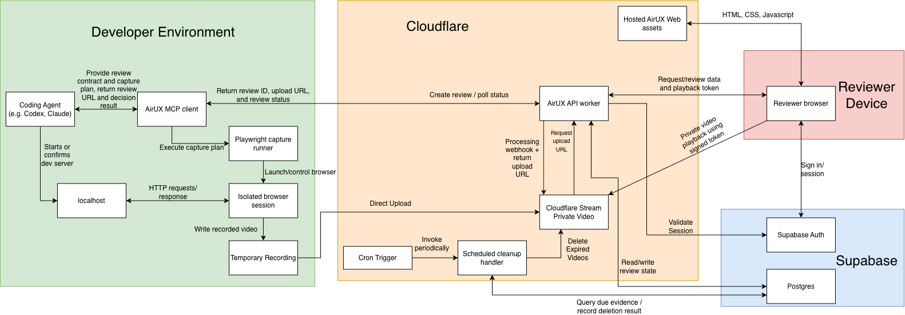

# AirUX Design Document

## 1. Description

**AirUX — Agent Interaction Review UX** is a human-verification layer for autonomous software agents.

Its purpose is to close the loop between an agent completing interactive work and a human trusting that the work behaves as intended. Instead of requiring the human to manually open the application, reproduce the agent’s workflow, and visually inspect the result, AirUX allows the agent to capture evidence of its work and submit that evidence for asynchronous human review.

For the initial MVP, AirUX focuses on **web developers using remote agents such as Codex or Claude to build website features while AFK**. An agent uses an AirUX MCP integration to record a short browser session demonstrating the feature it has implemented. AirUX securely uploads and hosts that footage, then returns a review link through the remote agent interface and waits for the human’s decision.

The human opens the review link, signs into AirUX if necessary, watches the footage, and chooses either **Approve** or **Request changes**, leaving feedback when changes are needed. AirUX then communicates that result back to the agent, which can either proceed with its task or continue iterating.

The immediate promise is simple: **review and approve visual agent work from anywhere**. The long-term goal is for AirUX to become the protocol agents use to present evidence, obtain authorized human judgment, and continue their work across interactive environments.

---

## 2. Problem

Autonomous coding agents are increasingly capable of implementing complete features without continuous human supervision. This enables highly asynchronous workflows: a developer can give an agent a task, leave their computer, and allow the agent to continue working remotely.

However, interactive and visual work introduces a trust gap.

An agent may be able to determine that:

- the application compiles;
- tests pass;
- a button exists;
- a route loads;
- a request succeeds;
- expected DOM elements appear.

These checks do not reliably answer subjective or experiential questions such as:

- Does the interaction actually feel correct?
- Does the page look polished?
- Is the animation too slow?
- Is an element clipped on mobile?
- Does the flow match what the user intended?
- Does a drag, hover, swipe, or transition behave naturally?

Today, the human typically has two poor options.

The first is to **trust the agent’s self-assessment**, which risks discovering visual or UX problems much later.

The second is to **manually reproduce and inspect the agent’s work**, requiring the human to reconnect to the development environment, open the application, navigate to the relevant state, and perform the interaction themselves. This undermines the benefit of asynchronous and AFK agent workflows.

The missing primitive is a lightweight mechanism through which an agent can say:

> “I believe this work is complete. Here is the exact interaction you need to see. Please approve it before I continue.”

AirUX provides that primitive.

---

## 3. Success Criteria

AirUX succeeds when it meaningfully increases trust in autonomous agent work without reintroducing the burden of manually testing that work.

For the MVP, success should be measured primarily by workflow quality rather than feature breadth.

The MVP hypothesis is:

> **AirUX lets developers confidently review and resolve visual agent work from another device without opening the development environment or reproducing the interaction.**

The MVP succeeds when:

1. **Reviews are completed remotely.** Users can approve or request changes from another device without opening the branch, running the application, or returning to the terminal. Measure the share of reviews completed this way.
2. **Users delegate more.** Users trust agents with visual website work they previously would not have assigned while AFK.
3. **Review is fast.** Reviewers can understand the claim, inspect the footage, and decide with few interactions. Measure time from opening the review to decision.
4. **The workflow repeats.** Users continue requesting AirUX reviews for later eligible tasks rather than treating AirUX as a one-time experiment.
5. **Requests for changes are actionable.** The agent can respond to feedback without the user reproducing the issue or providing another synchronous explanation.
6. **Integration is lightweight and interface-independent.** An MCP-compatible agent can create a review and receive a structured result regardless of whether it runs in a CLI, IDE, chat, or remote agent interface.
7. **Evidence remains focused and private.** Recordings are short, deliberate, and accessible only to authorized users.

The strongest signal is a user changing from “I do not trust an agent to build this while I am away” to “I will delegate this because AirUX lets me verify the result.”

---

## 4. Proposal

### 4.1 Core Experience

AirUX introduces an asynchronous human-review checkpoint into an agent workflow:

**Agent performs work → Agent submits a focused review → Human judges the evidence → Agent receives the decision → Agent continues**

For example:

```text
> Implement the redesigned onboarding flow and verify mobile behavior.

✓ Implemented onboarding changes
✓ Application builds
✓ Review prepared

Human review required:
https://airux.app/reviews/rvw_abc123

Waiting for review...
```

The user opens the link from any device, signs in if necessary, reviews the submitted evidence, and either approves the work or requests changes. The decision returns to the agent without requiring the user to reopen the development environment.

### 4.2 Review Contract

The central AirUX resource is a **Review**, representing one claim by an agent that requires human judgment. Each Review contains:

1. **Claim:** what the agent says is complete;
2. **Review criteria:** what the human is being asked to judge;
3. **Evidence:** the focused demonstration supporting the claim.

Approval applies only to the stated claim and criteria based on the evidence shown; it does not certify the entire implementation. The Review remains independent of the agent or reviewer interface used to create or resolve it.

### 4.3 Agent Experience

The user decides when review is required through their prompt or agent instructions. When the checkpoint is reached, the agent prepares a short demonstration, submits the Review, presents its URL, and waits asynchronously for the result.

If approved, the agent continues. If changes are requested, the agent receives the reviewer’s feedback and resumes implementation.

### 4.4 Human Review Experience

The review page should optimize for one question:

> “Can I confidently approve this work?”

It contains only the Review title, claim, criteria, evidence, and decision controls. The experience should be mobile-friendly and follow the principle:

**Evidence first, controls second, infrastructure invisible.**

The page should make the approval boundary clear. If the evidence is insufficient, the reviewer should request changes and state what must be corrected or shown.

### 4.5 Decision and Feedback

The reviewer chooses **Approve** or **Request changes**. Requesting changes requires a concise text comment so the agent can act without further synchronous explanation; an approval comment is optional.

Timestamped comments, visual annotations, and discussion threads are post-MVP goals.

---

## 5. Open MVP Decisions

The architecture is defined, but two product defaults still require validation:

1. **Capture policy.** Recording duration, default viewport, and the initial action vocabulary must keep evidence focused without blocking common demonstrations.
2. **Retention policy.** The initial expiry and deletion periods must balance reviewer convenience, privacy, and storage cost.

Agent credential onboarding is resolved for the MVP: a signed-in reviewer uses
the web credential manager to create, copy once, list, and revoke agent
credentials.

---

## 6. Technical Design



### 6.1 System Architecture and Hosting

AirUX separates local browser capture from cloud review and storage. The user’s development application remains on localhost; only deliberately recorded evidence is uploaded.

Technical requirements:

- Host the AirUX web assets and REST API on Cloudflare.
- Serve the web application as static HTML, CSS, and JavaScript loaded by the reviewer’s browser.
- Use Cloudflare Stream for private video upload, processing, storage, and playback.
- Use Supabase Auth for reviewer authentication and Supabase Postgres for application state.
- Do not require the local development application to be publicly reachable.

### 6.2 Deployment

The hosted AirUX components should deploy as a small number of managed units with separate production and development resources. The local MCP client and Playwright runner are installed in the developer environment rather than hosted by AirUX.

Technical requirements:

- Package the hosted web assets, API request handler, and scheduled cleanup handler in one Cloudflare Worker project.
- Serve the web application from `airux.app` and the versioned API from the same origin under `/api/v1`.
- Use separate Cloudflare Stream and Supabase resources for production and development.
- Store service credentials and environment-specific configuration in Cloudflare bindings and secrets, never in source control.
- Maintain versioned Postgres migrations and apply backward-compatible migrations before dependent application deployments.
- Distribute the MCP client and Playwright runner as a versioned package installed and executed locally.

### 6.3 Local Browser Capture

The AirUX MCP client records a focused demonstration of the agent’s work using an isolated Playwright browser session. Browser interaction is constrained to a small, validated action vocabulary.

The capture contract contains:

```typescript
{
  start_url: string;
  viewport: {
    width: number;
    height: number;
  };
  max_duration_ms: number;
  steps: CaptureStep[];
}
```

Initial capture actions are:

```text
goto
click
fill
press
hover
drag
scroll
wait_for
pause
```

Technical requirements:

- The coding agent starts or confirms the local development server.
- The MCP client passes the capture plan to the Playwright runner.
- The runner launches an ephemeral browser context and records its viewport.
- Capture targets default to localhost and loopback addresses.
- Recording duration, viewport, selectors, and action timeouts are validated.
- Arbitrary JavaScript execution is not supported through the capture contract.
- The temporary recording is deleted after Stream confirms successful processing.

### 6.4 Review Creation and Video Upload

The MCP client creates the Review and uploads its recording without routing video data through the AirUX API. A Review becomes available for judgment only after Stream confirms that its video is ready.

The create-review request contains:

```typescript
{
  client_request_id: string;
  title: string;
  claim: string;
  criteria: Array<{
    id: string;
    prompt: string;
  }>;
  evidence: {
    kind: "browser_video";
    media_type: string;
    size_bytes: number;
  };
}
```

The API returns:

```typescript
{
  review_id: string;
  review_url: string;
  status: "draft";
  evidence_id: string;
  upload_url: string;
  upload_expires_at: string;
}
```

Technical requirements:

- The API creates the Review and Evidence records before issuing an upload URL.
- The API requests a one-time upload URL from Cloudflare Stream.
- The MVP uses Stream's basic direct-upload binding and accepts recordings up
  to 200 MiB; larger resumable `tus` uploads are deferred.
- The MCP client uploads the recording directly to Stream.
- The MCP client accepts direct-upload destinations only on Cloudflare Stream's
  canonical HTTPS upload origin and never sends an agent credential with the
  upload request.
- Stream sends a signed processing webhook when the video becomes ready or fails.
- A successful webhook transitions the Evidence to `ready` and the Review to `pending`.
- After Stream accepts the upload, the MCP client polls the authenticated Review
  state for up to five minutes and deletes the temporary recording only after
  its Evidence becomes `ready`; upload errors, processing failures, and timeouts
  preserve the recording for retry.
- `client_request_id` prevents duplicate Reviews when creation is retried.

### 6.5 Authentication and Authorization

AirUX uses separate authentication mechanisms for reviewers and agents. A review URL identifies a Review but never grants access to it.

Technical requirements:

- Reviewers authenticate through Supabase Auth using GitHub OAuth.
- Supabase manages user identities and authentication data; AirUX stores no password hashes.
- The reviewer browser sends its authenticated session when calling the API.
- The API validates the session and verifies that `review.user_id` matches the authenticated user.
- Agents authenticate using revocable, high-entropy credentials associated with the same user.
- Agent credentials are displayed once and stored only as hashes.
- Agent credential tokens use `airux_agent_v1.<credential_uuid>.<base64url_secret>` with a 256-bit random secret.
- The API stores a SHA-256 digest of the complete token and never stores or returns the plaintext after creation.
- Agent API requests send the credential using the standard `Authorization: Bearer <token>` header.
- The Worker uses the embedded credential UUID for an indexed lookup, excludes revoked records, and compares the complete-token digest using a timing-safe operation.
- Successful agent authentication exposes only the credential ID and owning user ID to agent route handlers; fixed route boundaries provide the MVP permissions without stored scopes.
- Updating `last_used_at` is deferred until usage tracking is required independently of authentication.
- Agent credentials may create Reviews, poll their status, list Reviews they created, and cancel them.
- Agent credentials cannot view private video or submit decisions.
- Privileged credential-management queries both filter by the authenticated
  reviewer UUID and reject any returned row whose owner does not match.

### 6.6 Human Review and Decision

The review page presents the claim, criteria, and video evidence with minimal controls. The reviewer can approve the Review or request changes.

The decision contract is:

```typescript
{
  expected_version: number;
  outcome: "approved" | "changes_requested";
  comment?: string;
}
```

Technical requirements:

- The reviewer browser requests Review data from the API.
- After authorization, the API returns a short-lived Stream playback token.
- The browser plays the private video directly from Cloudflare Stream.
- The API writes the Decision and Review status transition in one Postgres transaction.
- `expected_version` prevents conflicting decisions from multiple requests.
- A comment is required when requesting changes and optional when approving.
- A Review may receive only one terminal Decision.

### 6.7 Review State and Persistence

Postgres is the source of truth for Review ownership, evidence readiness, decisions, and retention. Review and Evidence lifecycles are tracked separately.

Review states:

```text
draft
pending
approved
changes_requested
cancelled
expired
```

Evidence states:

```text
awaiting_upload
processing
ready
failed
deleting
deleted
```

The MVP uses four application tables:

```text
AgentCredential
---------------
id
user_id
name
secret_hash
created_at
last_used_at
revoked_at

Review
------
id
user_id
agent_credential_id
client_request_id
title
claim
criteria
status
version
created_at
submitted_at
expires_at
resolved_at
deleted_at

Evidence
--------
id
review_id
kind
status
stream_video_id
media_type
size_bytes
duration_ms
width
height
failure_code
delete_after
deleted_at
created_at

Decision
--------
id
review_id
user_id
outcome
comment
created_at
```

Technical requirements:

- The MVP supports one reviewer and one video per Review.
- Criteria are stored as a validated JSON array on the Review.
- Claim, criteria, and evidence membership become immutable when the Review becomes `pending`.
- Only a `pending` Review may transition to a human decision.
- Provider URLs are not stored; only the Stream video identifier is persisted.
- Review identifiers are cryptographically random and non-sequential.
- Review transitions are `draft` to `pending`, `cancelled`, or `expired`, and
  `pending` to `approved`, `changes_requested`, `cancelled`, or `expired`.
- Evidence transitions are `awaiting_upload` to `processing`, `failed`, or
  `deleting`; `processing` to `ready`, `failed`, or `deleting`; `ready` or
  `failed` to `deleting`; and `deleting` to `deleted`.
- Repeating the current state is an idempotent no-op; terminal states have no
  outgoing transitions.
- Postgres functions atomically compare the expected state, apply lifecycle
  timestamps, and increment the Review version. Database triggers reject
  invalid direct state updates, and a Review cannot become `pending` before its
  Evidence is `ready`.

### 6.8 Agent Result Delivery

The MCP client polls AirUX until the Review reaches a terminal state or expires. Review state is stored remotely so an interrupted agent can resume safely.

The MVP exposes four MCP tools:

```text
airux_create_review
airux_get_review
airux_list_open_reviews
airux_cancel_review
```

Technical requirements:

- `airux_create_review` coordinates capture, Review creation, and upload.
- `airux_get_review` returns the current status and Decision, if present.
- `airux_list_open_reviews` returns unresolved Reviews created by the current credential.
- `airux_cancel_review` cancels a draft or pending Review.
- Polling uses increasing intervals and server-provided retry guidance.
- The MCP client returns the Review URL and final structured result to the coding agent.

### 6.9 Retention and Cleanup

AirUX automatically removes expired video evidence while preserving immediate user control over access. Cleanup is performed by a scheduled Cloudflare handler rather than an always-running service or queue.

Initial retention defaults are:

```text
Upload URL                 15 minutes
Draft Review               1 hour
Pending Review             72 hours
Evidence after resolution  7 days
Playback token             10–15 minutes
```

Technical requirements:

- Each Evidence record contains a `delete_after` timestamp.
- A Cloudflare Cron Trigger periodically invokes the cleanup handler.
- The handler queries Postgres for due Evidence, deletes the corresponding Stream video, and records the result.
- Failed deletions remain eligible for retry on the next invocation.
- Deleting a Review immediately revokes access and schedules its Evidence for deletion.
- Stream’s longer scheduled-deletion feature may be used as a final cleanup backstop.

### 6.10 REST API

The Cloudflare Worker exposes a versioned API for agent operations, human review, and Stream callbacks.

Reviewer credential endpoints:

```text
POST /api/v1/agent-credentials
GET  /api/v1/agent-credentials
POST /api/v1/agent-credentials/:id/revoke
```

Agent endpoints:

```text
POST /api/v1/agent/reviews
GET  /api/v1/agent/reviews/:id
GET  /api/v1/agent/reviews
POST /api/v1/agent/reviews/:id/cancel
```

Reviewer endpoints:

```text
GET    /api/v1/reviews/:id
POST   /api/v1/reviews/:id/decision
POST   /api/v1/evidence/:id/playback-token
DELETE /api/v1/reviews/:id
```

Provider endpoint:

```text
POST /api/v1/webhooks/cloudflare-stream
```

Technical requirements:

- Every endpoint validates its request against a shared versioned schema.
- Mutating agent requests are idempotent.
- Reusing `client_request_id` with the same creation payload returns the
  existing Review; reusing it with different content returns a conflict.
- Agent detail responses include Review metadata, Evidence state, and terminal
  Decision feedback while excluding owner IDs, credential IDs, Stream video
  IDs, and deletion metadata. Open-list responses use compact draft and pending
  Review summaries.
- Reviewer detail and Decision responses include title, claim, criteria,
  lifecycle metadata, Evidence presentation metadata, and terminal Decision
  feedback while excluding owner IDs, credential IDs, Stream video IDs, and
  deletion metadata.
- Reviewer decisions are accepted only for an owned, nondeleted `pending`
  Review at the exact `expected_version`. Stale, repeated, and already-terminal
  submissions return a conflict even when the requested outcome is identical.
- All timestamps use UTC and RFC 3339 formatting.
- Unauthorized and nonexistent Reviews return equivalent responses.
- Private responses and playback-token responses are not cacheable.

### 6.11 Security and Privacy

AirUX receives only the evidence and context deliberately submitted for review. It does not receive unrestricted access to the user’s computer, agent session, or development environment.

Technical requirements:

- Encrypt all network traffic and use private Stream videos.
- Treat upload URLs and playback tokens as short-lived bearer credentials.
- Verify Review ownership server-side for every metadata, decision, and playback request.
- Verify Stream webhook signatures before updating Evidence.
- Exclude credentials, signed URLs, claims, and comments from application logs.
- Render reviewer comments as plain text.
- Apply server-side limits to recording duration, file size, field lengths, and request rates.
- Make deletion and cleanup operations idempotent.

### 6.12 MVP Boundaries and Extension Points

The MVP intentionally supports one reviewer and one video per Review. Future capabilities should extend the Review abstraction without adding unused infrastructure to the initial implementation.

Deferred extensions include:

- R2 and additional Evidence types for screenshots or documents.
- Queues and an event outbox for Slack notifications and webhooks.
- Workspaces and membership tables for organizations.
- Review assignments and policies for multiple reviewers.
- Additional local capture adapters for desktop and mobile environments.

---

## 7. Milestones

Milestones are integration checkpoints. Individual subtasks may begin before earlier milestones are complete when their listed prerequisites are satisfied.

### M1: Establish shared foundations

**Completion Outcome:** Project skeleton, contracts, database schema, and managed environments are ready.

| ID | Subtask | Short description | Status | Prerequisites |
|---|---|---|---|---|
| M1-1 | Project structure | Establish TypeScript packages for the Worker, web application, MCP client, and shared code. | Completed | — |
| M1-2 | Development tooling | Configure formatting, linting, type-checking, tests, and local commands. | Completed | M1-1 |
| M1-3 | Shared contracts | Define versioned schemas for capture plans, Reviews, Evidence, Decisions, states, and API errors. | Completed | M1-1 |
| M1-4 | Cloudflare skeleton | Deploy static assets, a health-check API route, and an empty scheduled handler. | Completed | M1-1 |
| M1-5 | Supabase foundation | Create isolated development and production resources and establish versioned migrations. | Completed | M1-1 |
| M1-6 | Core database schema | Add the four application tables, relationships, indexes, and constraints. | Completed | M1-3, M1-5 |
| M1-7 | Configuration | Define typed environment configuration and store secrets outside source control. | Completed | M1-4, M1-5 |

### M2: Implement identity and access

**Completion Outcome:** Reviewers and agents authenticate with enforced ownership boundaries.

| ID | Subtask | Short description | Status | Prerequisites |
|---|---|---|---|---|
| M2-1 | Reviewer sign-in | Implement GitHub OAuth and browser session handling through Supabase Auth. | Completed | M1-4, M1-5 |
| M2-2 | Session validation | Validate reviewer sessions in the API Worker and expose the authenticated user. | Completed | M1-3, M2-1 |
| M2-3 | Agent credential lifecycle | Create, display once, hash, list, and revoke agent credentials. | Completed | M1-6, M2-2 |
| M2-4 | Agent authentication | Authenticate MCP requests and enforce credential permissions. | Completed | M1-3, M2-3 |
| M2-5 | Authorization tests | Verify reviewer ownership and agent credential isolation. | Completed | M2-2, M2-4 |

### M3: Implement the Review domain

**Completion Outcome:** Review lifecycle and agent/reviewer APIs work against Postgres.

| ID | Subtask | Short description | Status | Prerequisites |
|---|---|---|---|---|
| M3-1 | State-transition service | Implement and test allowed Review and Evidence lifecycle transitions. | Completed | M1-3, M1-6 |
| M3-2 | Agent Review API | Implement create, get, list-open, and cancel endpoints with creation idempotency. | Completed | M2-4, M3-1 |
| M3-3 | Reviewer API | Implement authorized Review retrieval and transactional, version-checked decisions. | Completed | M2-2, M3-1 |
| M3-4 | API contract tests | Verify validation, authorization, idempotency, and conflicting-decision behavior. | Completed | M3-2, M3-3 |

### M4: Capture and upload evidence

**Completion Outcome:** Agents can record localhost and upload private video to Cloudflare Stream.

| ID | Subtask | Short description | Status | Prerequisites |
|---|---|---|---|---|
| M4-1 | Capture-plan runner | Validate and execute the constrained Playwright action vocabulary. | Completed | M1-3 |
| M4-2 | Browser recording | Record an isolated session with host, viewport, duration, and timeout limits. | Completed | M4-1 |
| M4-3 | Stream upload integration | Request one-time private upload URLs from Cloudflare Stream. | Completed | M1-7, M3-1 |
| M4-4 | Stream webhook | Verify processing webhooks and update Evidence and Review states. | Completed | M3-1, M4-3 |
| M4-5 | Direct upload workflow | Upload temporary recordings directly to Stream and remove local files after confirmation. | Completed | M4-2, M4-3, M4-4 |
| M4-6 | Create-review MCP tool | Coordinate capture, Review creation, upload, and review-link delivery. | Not Started | M3-2, M4-5 |

### M5: Enable human review

**Completion Outcome:** Reviewers can watch evidence and submit an authorized decision.

| ID | Subtask | Short description | Status | Prerequisites |
|---|---|---|---|---|
| M5-1 | Review UI shell | Build the responsive Review route with fixture data and loading/error states. | Not Started | M1-3 |
| M5-2 | Review presentation | Display the title, claim, criteria, status, and decision controls. | Not Started | M5-1 |
| M5-3 | UI authentication | Connect the web application to reviewer sign-in and protected Review routes. | Not Started | M2-1, M5-1 |
| M5-4 | Private playback | Issue short-lived playback tokens and play video directly from Stream. | Not Started | M3-3, M4-4, M5-2, M5-3 |
| M5-5 | Decision experience | Connect Approve and Request changes to the transactional Decision API. | Not Started | M3-3, M5-2, M5-3 |
| M5-6 | Review-flow integration | Verify capture, upload, playback, and decision across desktop and mobile layouts. | Not Started | M4-6, M5-4, M5-5 |

### M6: Complete the asynchronous lifecycle

**Completion Outcome:** Agents can resume work and expired evidence is reliably removed.

| ID | Subtask | Short description | Status | Prerequisites |
|---|---|---|---|---|
| M6-1 | Result polling | Implement `airux_get_review` with increasing intervals and retry guidance. | Not Started | M3-2, M4-6 |
| M6-2 | Agent resumption | Implement `airux_list_open_reviews` and recovery after interruption. | Not Started | M3-2, M6-1 |
| M6-3 | Cancellation | Complete cancellation behavior across MCP, API, Review state, and Evidence. | Not Started | M3-2, M4-4 |
| M6-4 | Expiration policy | Calculate and persist upload, draft, pending, playback, and evidence expiry times. | Not Started | M3-1 |
| M6-5 | Scheduled cleanup | Query due Evidence, delete Stream videos, and record deletion results. | Not Started | M1-4, M4-3, M6-4 |
| M6-6 | Cleanup reliability | Make deletion idempotent and retry failures during later Cron invocations. | Not Started | M6-5 |

### M7: Harden and release the MVP

**Completion Outcome:** The production workflow is secure, observable, tested, and documented.

| ID | Subtask | Short description | Status | Prerequisites |
|---|---|---|---|---|
| M7-1 | Security controls | Add rate limits, secure headers, request limits, webhook verification, and log redaction. | Not Started | M2-5, M4-4, M5-5 |
| M7-2 | Observability | Add privacy-safe error reporting, operational metrics, cleanup monitoring, and alerts. | Not Started | M1-4, M4-4, M6-5 |
| M7-3 | Deployment workflow | Automate migrations and Cloudflare deployment with environment isolation. | Not Started | M1-4, M1-5, M1-7 |
| M7-4 | End-to-end coverage | Test authentication, upload failures, decisions, resumption, expiry, and deletion. | Not Started | M5-6, M6-6, M7-1 |
| M7-5 | User onboarding | Document sign-in, credential setup, MCP installation, first Review, and revocation. | Not Started | M4-6, M6-2 |
| M7-6 | MVP release validation | Run the production workflow end to end and confirm retention and privacy behavior. | Not Started | M7-2, M7-3, M7-4, M7-5 |

---

## 8. Post-MVP Goals

Initial post-MVP goals are:

1. **Slack integration.** Notify users when reviews are ready or resolved, link directly to the review, and eventually allow decisions from Slack.
2. **Multimodal evidence.** Let a Review combine session footage with screenshots, images, and other relevant artifacts while preserving the claim → criteria → evidence contract.
3. **Broader capture surfaces.** Add desktop applications, iOS and Android simulators, physical devices, and other interactive environments through evidence adapters.
4. **Richer asynchronous review.** Add timestamped and region-based feedback, non-blocking review orchestration, multiple reviewers, and organization-level permissions.

---

## 9. Product Principles

AirUX should be guided by several principles.

**Human judgment, not human testing.** The user should evaluate evidence rather than recreate the interaction themselves.

**Explicit, scoped review.** Every review states the agent's claim, the criteria the human should judge, and the evidence supporting it. Approval applies to that scope rather than certifying the entire implementation.

**Minimum necessary evidence.** Reviews should be short and focused.

**User-directed checkpoints.** The user decides when and how often the agent should request review.

**Evidence first, few controls.** The primary workflow is watch → approve or request changes.

**Secure by default.** A link identifies a review; authentication grants access to it.

**Interface- and evidence-independent.** The Review protocol should not depend on a particular agent client or evidence format, even though the MVP uses remote coding agents and browser footage.

**Asynchronous by design.** Human judgment should not force users back into synchronous supervision.

---

## 10. Longer-Term Vision

AirUX can evolve from a website-review tool into the general protocol agents use to obtain human judgment. Its enduring value is the complete, resumable handoff:

**Agent makes a claim → Agent supplies evidence → Human gives an authorized decision → Agent continues**

Eventually an agent may be able to request:

```text
human.review(...)
```

regardless of the agent interface, evidence format, or environment being reviewed. At that point, AirUX provides a missing primitive in autonomous-agent systems:

> **Agents can perform work independently, gather evidence of the result, and efficiently escalate subjective judgment back to the human when needed.**

AirUX closes that loop.
